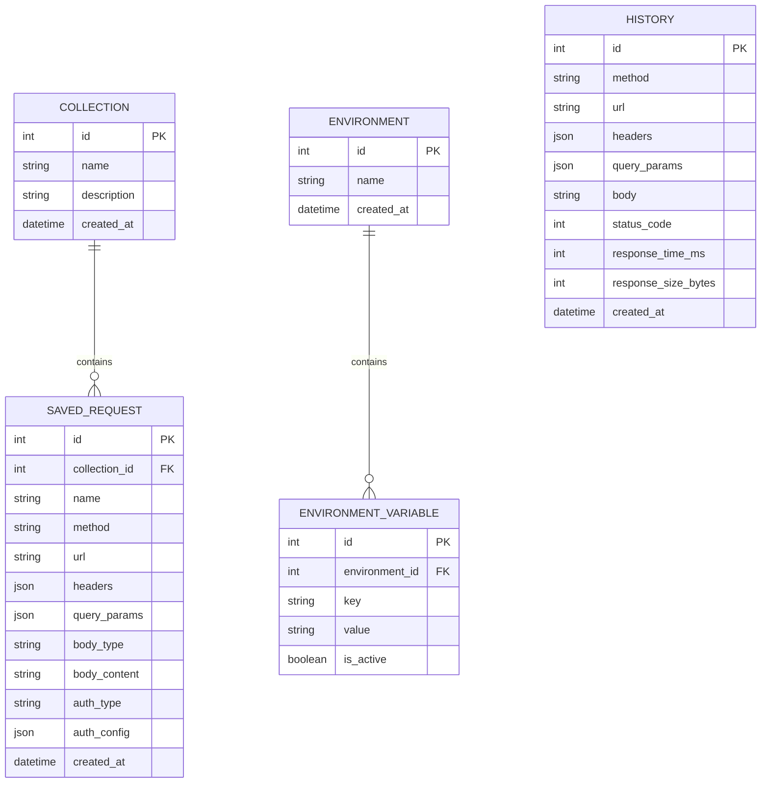

# Postman Clone (API Client Platform)

A high-performance, fully functional API client platform replicating the design, user experience, and core workflows of Postman. Built as a full-stack application featuring a React/Next.js frontend and a FastAPI/SQLite backend.

---

## 🚀 Live Deployments

*   **Frontend (Vercel):** [https://scalerlabs-postmanclone.vercel.app/](https://scalerlabs-postmanclone.vercel.app/)
*   **Backend API (Render):** [https://scalerlabs-postmanclone.onrender.com/](https://scalerlabs-postmanclone.onrender.com/seed)

> [!IMPORTANT]
> **RENDER COLD START NOTICE:**
> The backend is hosted on Render's Free Instance Tier. Render automatically spins down services after 15 minutes of inactivity. 
> 
> When opening the frontend for the first time, **the backend will take 45–60 seconds to spin back up**. 
> Please wait for the initial loading indicator to clear or visit the backend URL directly once to wake it up before testing requests or collections.

---

## 🏗️ Architecture & Key Decisions

The project is structured as a monorepo split into two primary layers: a modern single-page-application (SPA) client and a stateless Python proxy backend.

```
postman-clone/
├── backend/            # FastAPI, SQLite Database & Python HTTPX Proxy
└── frontend/           # Next.js, Tailwind CSS & Zustand State Manager
```

### 1. The Proxy Pattern (Bypassing CORS)
*   **Problem:** Browsers strictly enforce the Same-Origin Policy (SOP) and Cross-Origin Resource Sharing (CORS). Directly sending HTTP requests to arbitrary third-party APIs from a browser-based frontend would fail for almost all APIs that do not explicitly return CORS headers allowing the origin.
*   **Decision:** The request builder runner delegates the actual execution of HTTP requests to the backend server via a `/proxy/` endpoint. The backend uses Python's asynchronous HTTP client `httpx` to run requests server-side (where CORS is not enforced) and pipes the response headers, body, time, and size back to the frontend.

### 2. State Management via Zustand
*   **Decision:** Replicating Postman's tabbed request interface requires a robust global state engine. We chose `Zustand` because it is lightweight, has near-zero boilerplate, and easily coordinates state updates (like active tab tracking, collection sync, request mutation, and environment selection) without rendering bottlenecks.

### 3. FastAPI & SQLite
*   **Decision:** FastAPI provides automated OpenAPI documentation (`/docs`), fast developer iteration, and native support for async processes. SQLite is utilized as the persistent datastore for collections, history, and environments. Since this is a single-workspace deployment, a serverless file-based DB eliminates database setup overhead and easily persists on Render using disk mounts or instance runs.

---

## 💾 Database Schema

The backend persists application metadata (collections, request tabs, history, and variables) in a relational SQLite structure. 



---

## 🔌 API Overview

### 1. Collections & Requests
*   `GET /collections/` - Fetch all collections.
*   `POST /collections/` - Create a new collection.
*   `PUT /collections/{collection_id}` - Update a collection's details.
*   `DELETE /collections/{collection_id}` - Delete a collection.
*   `POST /collections/{collection_id}/requests/` - Add a saved request to a collection.
*   `PUT /requests/{request_id}` - Update request properties (headers, params, URL, method, body, auth).
*   `DELETE /requests/{request_id}` - Delete a request.

### 2. Environments & Variables
*   `GET /environments/` - Fetch all environments.
*   `POST /environments/` - Create a new environment.
*   `PUT /environments/{env_id}` - Update environment name.
*   `DELETE /environments/{env_id}` - Delete environment.
*   `POST /environments/{env_id}/variables/` - Create an environment variable.
*   `PUT /environments/{env_id}/variables/{var_id}` - Update variable values or active states.
*   `DELETE /environments/{env_id}/variables/{var_id}` - Delete a variable.

### 3. History
*   `GET /history/` - Fetch all request execution logs.
*   `DELETE /history/` - Clear all history entries.
*   `DELETE /history/{history_id}` - Delete a single history entry.

### 4. Proxy Execution & Seeding
*   `POST /proxy/` - Proxies an incoming request package to external targets and returns execution details (time, size, status, body).
*   `GET /seed` - Seeds the database with default environment variables (`{{base_url}}`) and a collections directory with sample API targets (JSONPlaceholder).

---

## 🛠️ Local Development Setup

### Prerequisite Tools
*   **Python** 3.9+ 
*   **Node.js** 18+ & **NPM**

### 1. Backend Server Setup
1. Open a terminal and navigate to the backend directory:
   ```bash
   cd backend
   ```
2. Create and activate a Python virtual environment:
   ```bash
   python -m venv venv
   # On Windows (PowerShell):
   .\venv\Scripts\Activate.ps1
   # On macOS/Linux:
   source venv/bin/activate
   ```
3. Install the dependencies:
   ```bash
   pip install -r requirements.txt
   ```
4. Start the FastAPI server locally:
   ```bash
   uvicorn main:app --reload --port 8000
   ```
5. *(Optional)* Seed the local DB with templates:
   Visit `http://localhost:8000/seed` in your browser.

### 2. Frontend client Setup
1. Open a new terminal and navigate to the frontend directory:
   ```bash
   cd frontend
   ```
2. Install npm dependencies:
   ```bash
   npm install
   ```
3. Create a `.env.local` file to target the local backend:
   ```env
   NEXT_PUBLIC_API_URL=http://localhost:8000
   ```
4. Run the development server:
   ```bash
   npm run dev
   ```
5. Open your browser and navigate to `http://localhost:3000`.
